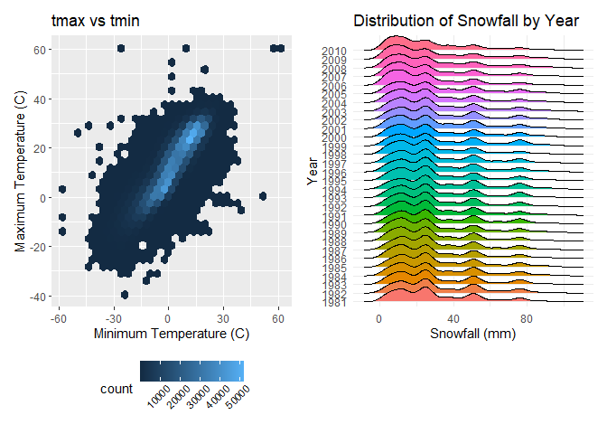
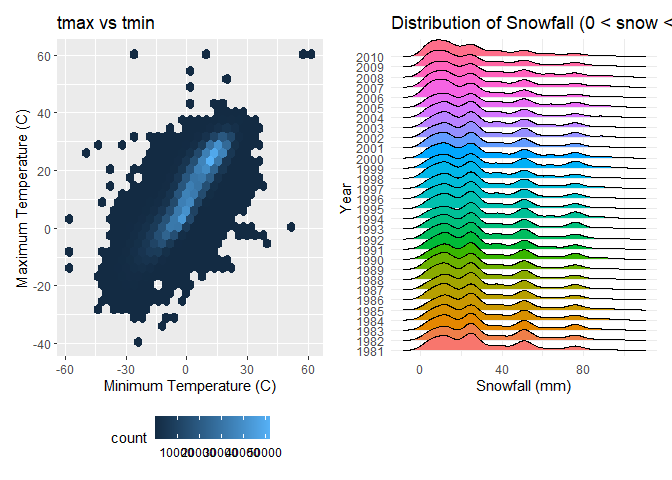
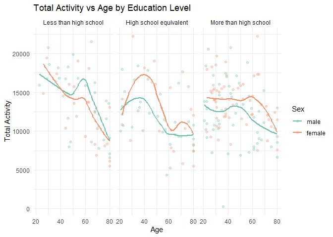

p8105_hw3_SZ3319
================
Shiyu Zhang
2024-10-09

## Problem 1

Import `ny_noaa` dataset and look at the size and the structure.

``` r
data("ny_noaa")
str(ny_noaa)
dim(ny_noaa)
head(ny_noaa)
skimr::skim(ny_noaa)
```

This dataset `ny_noaa` is weather observation data from the National
Oceanic and Atmospheric Administration (NOAA) in New York, which
includes **2595176** observations and **7** variables.

The **7** important variables are: **id, date, prcp, snow, snwd, tmax,
tmin**:

- `id` (Weather Station ID): the unique identifier for each observation
  station. **Type:** Character.

- `date` (Date of Observation): the date of the weather observation in
  the format YYYY-MM-DD. **Type:** Date.

- `prcp` (Precipitation): the precipitation amount in tenths of a
  millimeter, indicating the amount of rain that fell on a specific
  date. **Type:** Integer, which need to be transferred into numeric.

- `snow` (Snowfall): the snowfall amount in millimeters, indicating the
  depth of new snow that fell on a specific date. **Type:** Integer,
  which need to be transferred into numeric.

- `snwd` (Snow Depth): the snow depth in millimeters, indicating the
  thickness of the snowpack on a specific date. **Type:** Integer, which
  need to be transferred into numeric.

- `tmax` (Maximum Temperature): the maximum temperature in tenths of
  degrees Celsius, indicating the highest temperature recorded on a
  specific date. **Type:** Character, which need to be transferred into
  numeric.

- `tmin` (Minimum Temperature): the minimum temperature in tenths of
  degrees Celsius, indicating the lowest temperature recorded on a
  specific date. **Type:** Character, which need to be transferred into
  numeric.

There are

### 1.1 Clean the dataset

- Clean the dataset

``` r
ny_noaa = 
  data.frame(ny_noaa) |> 
  janitor::clean_names() |> 
  mutate(
    year = year(date),
    month = month(date),
    day = day(date),
    across(c(year, month, day, prcp, snow, snwd, tmin, tmax), as.numeric),
    prcp = prcp / 10,
    tmax = tmax / 10,
    tmin = tmin / 10
  )
```

View the

``` r
common_snow = 
  ny_noaa  |> 
  filter(snow >= 0)  |> 
  group_by(snow) |> 
  summarise(count = n()) |> 
  arrange(desc(count))  |> 
  head(10)
```

The result indicates that:

- **0 mm** snowfall is most common, which mens that on the majority of
  days, there was no snowfall in the New York area.
- Snowfall amounts of 25 mm or less are relatively common, reflecting
  winter snowfall patterns.
- Although snowfall greater than 100 mm is not common, it can still
  occur, particularly during extreme weather events.

### 1.2 Creat a

``` r
ny_noaa_month = 
  ny_noaa |>
  filter(
    month == c(1, 7),
    !is.na(tmax)
  ) |> 
  mutate(
    month = as.character(month),
    month = case_match(
      month,
      "1" ~ "January",
      "7" ~ "July"
    )
  ) |> 
  group_by(id, year, month) |> 
  summarize(avg_tmax = mean(tmax, na.rm = TRUE)) |> 
  ungroup()
```

Creat a plot.

``` r
ny_noaa_month |> 
  ggplot(aes(x = year, y = avg_tmax, colour = id)) +
  geom_line(alpha = .3) +
  labs(
    title = "Line graph of average maximum temperatures per year",
       x = "Date",
       y = "Maximum Temp (°C)"
  ) +
  facet_wrap(. ~ month) +
  scale_color_brewer(palette = "Set2") +
  theme_minimal() +
  theme(legend.position = "none")
```

    ## Warning in RColorBrewer::brewer.pal(n, pal): n too large, allowed maximum for palette Set2 is 8
    ## Returning the palette you asked for with that many colors

    ## Warning: Removed 7776 rows containing missing values or values outside the scale range
    ## (`geom_line()`).

<!-- -->

From the plot, it shows that:

- The clear temperature difference between January (winter) and July
  (summer) is consistent with expected seasonal variation.

- Overall, the trends in average maximum temperatures over the years are
  consistent across different stations. Individual outliers may be
  attributed to extreme climatic events occurring at specific weather
  station locations.

- Both months reflect seasonal temperature patterns typical for winter
  and summer. While January generally shows lower temperatures due to
  winter conditions, and July shows higher temperatures due to summer
  heat, both months may exhibit similar trends in their respective
  temperature increases or decreases over the years.

### 1.3 Create a

``` r
ny_noaa_clean = ny_noaa %>%
  janitor::clean_names() %>%
  mutate(
    snow = ifelse(snow > 0 & snow < 100, snow, NA)# Keep only snow values between 0 and 100
  ) |> 
   filter(
    !is.na(year),
    !is.na(snow)
    )

# Panel (i): tmax vs tmin
panel_i <- 
  ny_noaa |> 
  filter(
    !is.na(tmax),
    !is.na(tmin)
    ) |> 
  ggplot(aes(x = tmin, y = tmax)) +
  geom_hex() + # Using a hexbin plot instead of scatter
  labs(
    title = "tmax vs tmin",
    x = "Minimum Temperature (C)",
    y = "Maximum Temperature (C)"
  ) +
  theme(legend.position = "bottom")

library(ggridges)
# Panel (ii): Distribution of snowfall
panel_ii = 
  ny_noaa_clean |> 
  ggplot(aes(y = factor(year), x = snow, fill = factor(year))) +
  geom_density_ridges()+
  labs(
    title = "Distribution of Snowfall (0 < snow < 100) by Year",
    y = "Year",
    x = "Snowfall (mm)"
  ) +
  theme_minimal() +
  theme(legend.position = "none")

(panel_i + panel_ii) # combine 2 plots 
```

    ## Picking joint bandwidth of 3.76

<!-- -->

## Problem 2

### 2.0 Load the datesets

``` r
demo_df = 
  read_csv("data/nhanes_covar.csv", 
           na = c("NA", "", "."), 
           skip = 4) |> 
  janitor::clean_names()
str(demo_df)

ac_df = 
  read_csv("data/nhanes_accel.csv", na = c("NA", "", ".")) |> 
  janitor::clean_names() |> 
  na.omit()
```

### 2.1 Clean

Include all originally observed variables; exclude participants less
than 21 years of age, and those with missing demographic data; and
encode data with reasonable variable classes (i.e. not numeric, and
using factors with the ordering of tables and plots in mind).

``` r
demo_clean_df = 
  demo_df |> 
  filter(age >= 21) |>
  na.omit() |> 
  mutate(
    education = factor(education, 
                       levels = c("1", "2", "3"), 
                       labels = c("Less than high school", "High school equivalent", "More than high school"),
                       ordered = TRUE),
    sex = factor(sex, 
                 levels = c("1", "2"),
                 labels = c("male", "female"), 
                 ordered = TRUE)
  ) 
```

Joint the table

``` r
total_df = 
  demo_clean_df |> 
  left_join(ac_df, by = "seqn")
```

### 2.2 age table and plot

age table

``` r
edu_gender_table = 
  total_df  |> 
  group_by(education, sex)  |> 
  summarize(count = n())  |> 
  pivot_wider(names_from = sex, values_from = count, values_fill = 0)

kable(edu_gender_table, 
      col.names = c("Education Level", "Men", "Women"), 
      caption = "Number of Men and Women in Each Education Category")
```

| Education Level        | Men | Women |
|:-----------------------|----:|------:|
| Less than high school  |  27 |    28 |
| High school equivalent |  35 |    23 |
| More than high school  |  56 |    59 |

Number of Men and Women in Each Education Category

age plot

``` r
total_df |> 
  ggplot(aes(x = age, fill = sex)) +
  geom_histogram(bins = 20, position = "dodge") +
  facet_wrap(~ education) +
  scale_color_brewer(palette = "Set2") +
  labs(
    title = "Age Distribution by Education Level and Gender",
    x = "Age",
    y = "Count"
  ) +
  theme_minimal() +
  theme(legend.position = "bottom")
```

<!-- -->

### 2.3 activity table and plot

Create the total activity variable

``` r
activity_df = 
  total_df |> 
  mutate(
    total_activity = 
      rowSums(select(total_df, starts_with("min")),
              na.rm = TRUE)
  ) |> 
  select(seqn, sex, age, bmi, education, total_activity, everything())
```

Plot total activity vs age

``` r
activity_df |> 
  ggplot(aes(x = age, y = total_activity, color = sex)) +
  geom_point(alpha = .3) + 
  geom_smooth(method = "loess", se = FALSE) + 
  facet_grid(. ~ education) + 
  scale_color_brewer(palette = "Set2") +
  labs(
    title = "Total Activity vs Age by Education Level",
    x = "Age",
    y = "Total Activity",
    color = "Sex"
  ) +
  theme_minimal()
```

<!-- -->

### 2.4 Min

create long table

``` r
activity_long_df = 
  activity_df |> 
  pivot_longer(cols = starts_with("min"), names_to = "minute", values_to = "activity")  |> 
  mutate(
    minute = as.numeric(gsub("min", "", minute))
  )
```

plot1

``` r
activity_p1 = 
  activity_long_df |> 
  ggplot(aes(x = minute, y = activity, color = sex)) +
  geom_point(alpha = .1, size = 1) + 
  geom_smooth(se = FALSE) + 
  facet_wrap(~ education) + 
  scale_x_continuous(breaks = seq(0, 1440, by = 360), labels = function(x) x / 60) + 
  scale_color_brewer(palette = "Set2") +
  labs(
    title = "24-Hour Activity Time Course by Education Level and Sex",
    x = "Time of Day (hours)",
    y = "Activity (MIMS)",
    color = "sex"
  ) +
  theme_minimal()
```

p1 is not fancy and is hard to so, create p2

``` r
activity_p2 =
  activity_long_df  |> 
  group_by(education, sex, minute)  |> 
  summarise(mean_activity = mean(activity, na.rm = TRUE))  |> 
  ggplot(aes(x = minute, y = mean_activity, color = sex)) +
  geom_point(alpha = .1, size = 1) +
  geom_smooth(se = FALSE) +
  facet_wrap(~education) +
  scale_x_continuous(breaks = seq(0, 1440, by = 360), labels = function(x) x / 60) +
  scale_color_brewer(palette = "Set2") +
  labs(
    title = "24-Hour Activity by Education Level and Sex",
    x = "Hour of Day",
    y = "Mean Activity"
  ) +
  theme_minimal()
```

    ## `summarise()` has grouped output by 'education', 'sex'. You can override using
    ## the `.groups` argument.

``` r
activity_p2
```

    ## `geom_smooth()` using method = 'gam' and formula = 'y ~ s(x, bs = "cs")'

<!-- -->
